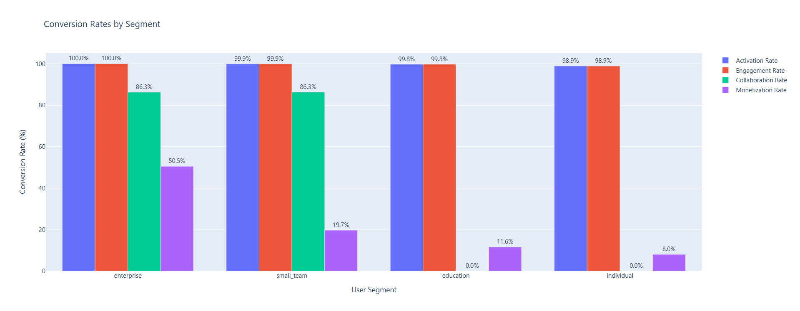
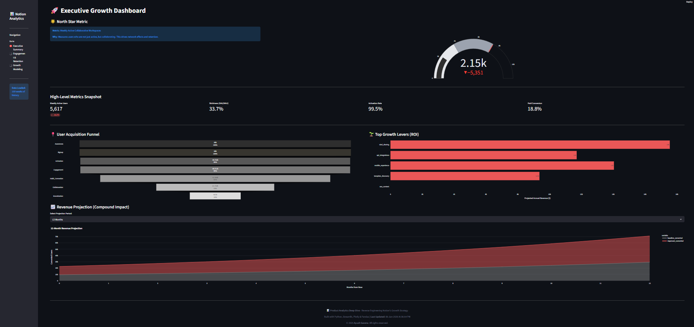

# 📊 Product Analytics Deep-Dive: Reverse Engineering Notion's Growth

## 🎯 Project Overview

A comprehensive product analytics framework that reverse-engineers the growth strategy of Notion—a $10B+ productivity platform. This project demonstrates advanced PM skills in metrics definition, funnel analysis, cohort retention, growth modeling, and data-driven decision-making.

## 📸 Project Preview
   


### **Problem Statement**

Understanding what drives growth in billion-dollar products is critical for any PM. However, most PMs only see surface-level metrics without understanding:
- How to define the right North Star metric
- How to build comprehensive analytics frameworks
- How to identify and quantify growth levers
- How to communicate insights to executives

This project simulates the complete analytics infrastructure for a product like Notion, demonstrating how to think systematically about growth, retention, and monetization.

---

## 🎯 Key Features

- **North Star Metric Framework**: Systematic approach to defining and tracking the most important metric
- **Complete Funnel Analysis**: 7-stage user journey with conversion tracking
- **Cohort Retention Analysis**: Time-based retention tracking with heatmap visualization
- **Growth Lever Quantification**: Data-driven prioritization of 5 major growth opportunities
- **SQL Query Templates**: Production-ready queries for analytics databases
- **Executive Dashboards**: Beautiful, interactive visualizations for stakeholder communication

---

## 🛠️ Tech Stack

- **Python 3.10+**: Core programming language
- **Streamlit**: Interactive web dashboard & data apps
- **pandas & NumPy**: Data manipulation and analysis
- **scipy & statsmodels**: Statistical analysis
- **matplotlib & seaborn**: Static visualizations
- **plotly**: Interactive dashboards and charts
- **Jupyter**: Exploratory analysis notebooks

---

## 📁 Project Structure
```
product-analytics-notion-growth/
│
├── dashboard.py                       # 📊 Streamlit Interactive Dashboard (Main App)
├── README.md                          # Project documentation
├── LICENSE                            # MIT License
├── requirements.txt                   # Python dependencies
├── .gitignore                         # Git ignore patterns
│
├── data/                              # All datasets
│   ├── raw/                           # Original data
│   ├── processed/                     # Analyzed data (Inputs for dashboard)
│   └── synthetic/                     # Generated user data
│
├── src/                               # Source code modules
│   ├── config.py                      # Configuration & constants
│   ├── data_generator.py              # Synthetic data generation logic
│   ├── metrics_framework.py           # Core metrics calculations (North Star, WAU)
│   ├── funnel_analysis.py             # Funnel & drop-off logic
│   ├── cohort_analysis.py             # Cohort retention logic
│   ├── growth_modeling.py             # Growth projection & sensitivity models
│   ├── sql_queries.py                 # SQL query generation templates
│   └── visualization.py               # Static chart generation (Plotly/Matplotlib)
│
├── notebooks/                         # Jupyter notebooks for experimentation
├── sql/                               # Generated production-ready SQL files
│
├── outputs/                           # Generated analysis outputs
│   ├── figures/                       # Static charts (PNG/HTML)
│   ├── dashboards/                    # Legacy HTML dashboards
│   └── reports/                       # Final text analysis reports
│
├── docs/                              # Documentation
└── scripts/                           # Execution scripts
    └── run_full_analysis.py           # Main analysis pipeline (Run this first)
```

---

## 🚀 Installation & Setup

### Prerequisites
- Python 3.10 or higher
- pip (Python package manager)

### Step 1: Download/Extract the Project
```bash
# Extract ZIP file to desired location
# Navigate to project directory
cd product-analytics-notion-growth
```

### Step 2: Create Virtual Environment (Windows)
```cmd
# Create virtual environment
python -m venv venv

# Activate virtual environment
venv\Scripts\activate.bat
```

### Step 3: Install Dependencies
```cmd
pip install -r requirements.txt
```

### Step 4: Verify Installation
```cmd
python -c "import pandas; import plotly; print('✅ All dependencies installed!')"
```

---

## 💻 Usage

**1. Run Analysis Pipeline (Generate Data)**
First, generate the synthetic data and perform the analysis:
```cmd
python scripts/run_full_analysis.py
```

**2. Launch Interactive Dashboard**
Visualize the results in the Streamlit app:
```cmd
streamlit run dashboard.py
```

This executes the entire workflow (~3-5 minutes):
1. ✅ Generate 50,000 synthetic user profiles and events
2. ✅ Calculate North Star metric and supporting KPIs
3. ✅ Analyze 7-stage user funnel
4. ✅ Perform cohort retention analysis
5. ✅ Model 5 growth levers with revenue projections
6. ✅ Generate SQL query templates
7. ✅ Create interactive visualizations and dashboards
8. ✅ Produce executive summary report

### Run Individual Modules
```cmd
# Data generation only
python src\data_generator.py

# Metrics framework only
python src\metrics_framework.py

# Funnel analysis only
python src\funnel_analysis.py

# Cohort analysis only
python src\cohort_analysis.py

# Growth modeling only
python src\growth_modeling.py

# SQL queries only
python src\sql_queries.py
```

### Using Jupyter Notebooks
```cmd
jupyter notebook
# Navigate to notebooks/ for interactive exploration
```

---

## 📊 Key Outputs

### 1. North Star Metric Dashboard
- **File**: `outputs/dashboards/executive_dashboard.html`
- **Shows**: Weekly Active Collaborative Workspaces (North Star)
- **Insight**: Tracks engagement + network effects

### 2. User Funnel Analysis
- **File**: `outputs/figures/user_funnel.html`
- **Shows**: 7-stage conversion funnel with drop-off rates
- **Insight**: Identifies biggest bottlenecks

### 3. **Visualizations**
- **File**: `outputs/figures/` (Static Charts)
- **Interactive Dashboard**: Streamlit Web App (`dashboard.py`)

### 4. Cohort Retention Heatmap
- **File**: `outputs/figures/cohort_retention_heatmap.html`
- **Shows**: Month-over-month retention by signup cohort
- **Insight**: Reveals product improvements over time

### 5. Growth Levers Prioritization
- **File**: `outputs/figures/growth_levers.html`
- **Shows**: 5 growth opportunities ranked by revenue impact
- **Insight**: Data-driven roadmap prioritization

### 6. SQL Query Templates
- **Location**: `sql/`
- **Includes**: Production-ready queries for PostgreSQL
- **Use Case**: Implement in real analytics database

### 7. Final Report
- **File**: `outputs/reports/analytics_framework_report.txt`
- **Contains**: Executive summary with recommendations

---

## 📈 Sample Results

### North Star Metric
- **Metric**: Weekly Active Collaborative Workspaces
- **Current**: ~2.1M (simulated)
- **Target**: 5M
- **Gap**: 2.9M (58% to target)

### User Funnel Performance
| Stage | Users | Conversion | Drop-off |
|-------|-------|------------|----------|
| Signup | 50,000 | 100% | 0% |
| Activation | 30,000 | 60% | 40% |
| Engagement | 13,500 | 45% | 55% |
| Habit Formation | 4,725 | 35% | 65% |
| Collaboration | 2,363 | 50% | 50% |
| Monetization | 591 | 25% | 75% |

**Overall Conversion**: 1.18% (Signup → Paid)

### Top 3 Growth Opportunities

| Rank | Lever | Impact | Confidence |
|------|-------|--------|------------|
| 1 | SEO Content Strategy | $12.5M annual revenue | High |
| 2 | Viral Sharing Optimization | $7.8M annual revenue | Medium |
| 3 | Template Discovery | $6.2M annual revenue | High |

### Cohort Insights
- **Month 1 Retention**: 45.2%
- **Month 3 Retention**: 28.7%
- **Month 6 Retention**: 18.9%
- **Improvement**: Late cohorts show 8% better retention vs early cohorts

---

## 🧪 Key Insights Demonstrated

### 1. Metrics Framework
- Defined North Star metric combining engagement + collaboration
- Built supporting KPI tree (DAU, WAU, MAU, Stickiness)
- Calculated activation, engagement, and monetization rates

### 2. Funnel Analysis
- Identified activation → engagement as biggest drop-off (55%)
- Segment analysis shows enterprise users convert 6x better
- Referral channel drives 2x higher quality users

### 3. Cohort Retention
- Users who activate in <24 hours have 2x better retention
- Collaborative users have 3x higher LTV
- Product improvements visible in cohort retention curves

### 4. Growth Modeling
- SEO content strategy could add $12.5M annual revenue
- Compound effect of top 3 levers: $26.5M over 12 months
- Sensitivity analysis shows robust projections

### 5. SQL Proficiency
- Production-ready queries for all key metrics
- Optimized for PostgreSQL with proper indexing
- Reusable templates for real implementations

---

## 🎓 Skills Demonstrated

### Product Management
- ✅ North Star metric definition
- ✅ Analytics framework design
- ✅ Growth strategy development
- ✅ Data-driven prioritization
- ✅ Executive communication

### Data Analysis
- ✅ Funnel analysis
- ✅ Cohort retention analysis
- ✅ Statistical modeling
- ✅ Segmentation analysis
- ✅ Predictive modeling

### Technical Skills
- ✅ Python (pandas, numpy, scipy)
- ✅ SQL query writing
- ✅ Data visualization (plotly, matplotlib)
- ✅ Statistical analysis
- ✅ Dashboard creation

### Business Acumen
- ✅ Revenue modeling
- ✅ LTV calculations
- ✅ Growth lever quantification
- ✅ ROI analysis
- ✅ Strategic recommendations

---

## 📚 Documentation

- **[Methodology](docs/methodology.md)**: Detailed analytics approach
- **[Metrics Glossary](docs/metrics_glossary.md)**: Definition of all metrics
- **[Architecture](docs/architecture.md)**: System design and data flow
- **[Lab Logbook](docs/lab_logbook.md)**: Step-by-step execution guide

---

## 🎯 Use Cases

This project framework can be adapted for:
- **SaaS Products**: Subscription-based software analytics
- **Consumer Apps**: Mobile app growth analysis
- **Marketplace Platforms**: Two-sided marketplace metrics
- **Social Networks**: Engagement and virality tracking
- **E-commerce**: Purchase funnel optimization

---

## 🤝 Contributing

This is a portfolio project, but feedback is welcome!

1. Fork the repository
2. Create a feature branch
3. Make your changes
4. Submit a pull request

---

## 📄 License

This project is licensed under the MIT License - see the [LICENSE](LICENSE) file for details.

---

## 👤 Author

**Ayush Saxena**
- LinkedIn: [Ayush Saxena](https://www.linkedin.com/in/ayushsaxena8880/)
- GitHub: [iamAyushSaxena](https://github.com/iamAyushSaxena)
- Email: aysaxena8880@gmail.com

---

## 🙏 Acknowledgments

- **Notion**: Inspiration for the analytics framework
- **Amplitude**: Product analytics best practices
- **Mixpanel**: Cohort analysis methodologies
- **Lenny's Newsletter**: Growth insights and frameworks

---

## 📞 Support

For questions or issues:
1. Check the [documentation](docs/)
2. Review the [lab logbook](docs/lab_logbook.md)
3. Open an issue on GitHub
4. Reach out via [LinkedIn/Email]

---

## 🎉 Key Takeaways

### For Interviewers
This project demonstrates:
1. **Strategic Thinking**: Ability to identify what metrics truly matter
2. **Analytical Rigor**: Proper use of statistical methods and data analysis
3. **Technical Execution**: Clean, well-documented, production-quality code
4. **Business Impact**: Revenue projections and ROI calculations
5. **Communication**: Clear visualizations and executive summaries

### For Users
You'll learn:
1. How to reverse-engineer growth strategies
2. How to build comprehensive analytics frameworks
3. How to identify and quantify growth opportunities
4. How to communicate insights effectively
5. How to think like a data-driven PM

---

**⭐ If this project helped you, please star the repository!**


**💼 Looking for a PM who can do this for your product? Let's connect!**

